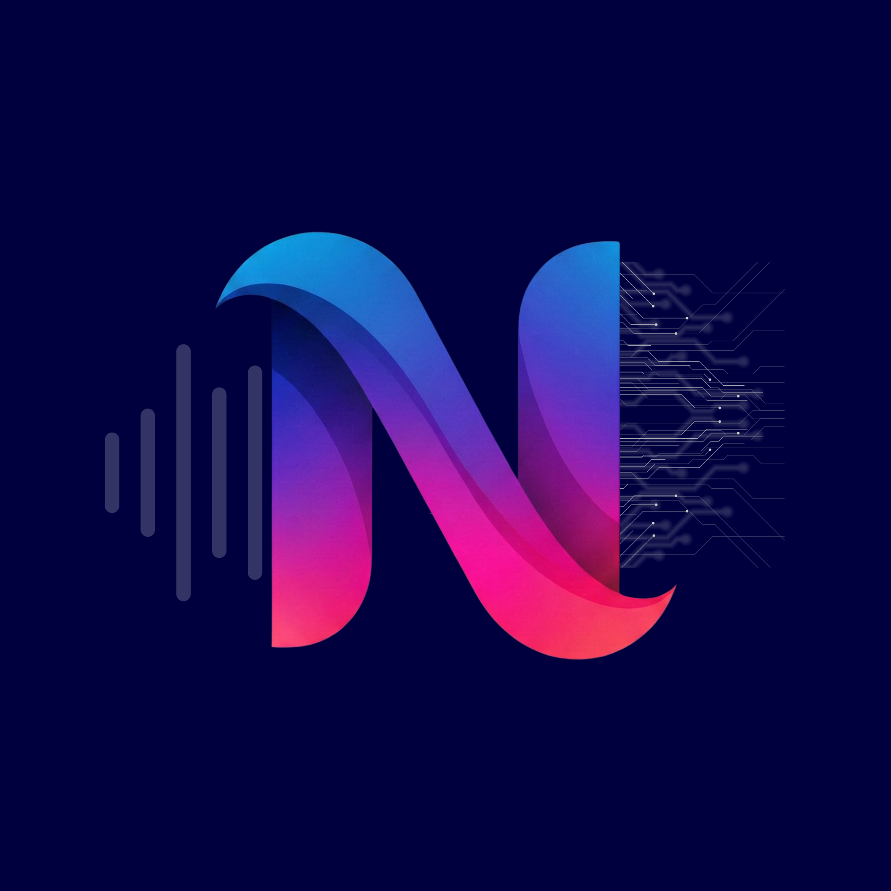

# 📝 Notitia - Application de Prise de Notes Intelligente


**Happy coding! 🎉**---- 💬 Contactez l'équipe de développement- 🐛 Créez une issue si vous avez des problèmes- 📖 [Documentation Flutter](https://flutter.dev/docs)## 🆘 Aide Supplémentaire---```flutter build web      # Webflutter build ios      # iOSflutter build apk      # Android# Build de productionflutter test# Lancer les testsflutter analyze# Analyser le code```bash## ✅ Vérifier que Tout Marche---```flutter rundart run flutter_native_splash:createflutter pub getflutter clean# Recompiler```bash### "Le splash screen ne s'affiche pas"```cd ..pod install --repo-updaterm -rf Pods Podfile.lockcd ios```bash### "Erreur iOS: Pods"```dart run flutter_launcher_icons --verbose# Régénérezls assets/notitia_logo.png# Vérifiez que l'image existe```bash### "Erreur à la génération des icônes"```flutter pub getflutter cleanflutter devices```bash### "Flutter ne trouve pas le device"## 📞 Dépannage---⚠️ **À exécuter une seule fois**, puis les fichiers générés sont commitables.- Configurable via `pubspec.yaml`- Affiche le logo au lancementGénère l'écran de splash (loading screen) :### `dart run flutter_native_splash:create`- Windows/Linux/macOS: Icônes natives- Web: `web/favicon.png`- iOS: `ios/Runner/Assets.xcassets/AppIcon.appiconset/`- Android: `android/app/src/main/res/mipmap-*/ic_launcher.png`Génère les icônes de l'application pour toutes les plateformes :### `dart run flutter_launcher_icons`## 🎯 Qu'Est-ce que les Commandes d'Icônes Font ?---```flutter run -d windows   # ou -d linux ou -d macos# Lancerdart run flutter_launcher_icons# Générer les icônesflutter pub get# Les dépendances s'installent automatiquement```bash### Windows / Linux / macOS---```flutter build web# Build productionflutter run -d chrome# Lancer en devdart run flutter_launcher_icons# Générer les assetsflutter config --enable-web# Activer le support web```bash### Web---- Accepter les licences : `sudo xcode-select --switch /Applications/Xcode.app/Contents/Developer`- Xcode installé**Prérequis :**```flutter run -d ios# Lancer sur iOSdart run flutter_launcher_icons# Générer les icônescd ..pod install --repo-updatecd ios# Installer les pods```bash### iOS (macOS uniquement)---- `gradle failed` → `flutter clean` et réessayez- `JAVA_HOME not found` → Installez Android Studio**Problèmes courants :**```flutter run -d android# Lancer sur Androiddart run flutter_launcher_icons# Générer les icônescd .../gradlew cleancd android# Nettoyer et rebuildflutter doctor -v# Vérifier la config```bash### Android (Tous les OS)## 🔧 Setup Détaillé par Plateforme---- [ ] L'app se lance sans erreur- [ ] Commandes de setup lancées (icons + splash)- [ ] `flutter pub get` exécuté- [ ] Repository cloné- [ ] Un émulateur ou device connecté (`flutter devices`)- [ ] Flutter installé et à jour (`flutter --version`)## 📋 Checklist Initiale---```flutter run# 4. Lancer l'appdart run flutter_native_splash:createdart run flutter_launcher_icons# 3. Générer les icônes et splash screen (TRÈS IMPORTANT!)flutter pub get# 2. Installer les dépendancescd notitia-mvpgit clone https://github.com/VOTRE_ORGANISATION/notitia-mvp.git# 1. Cloner le repo```bash## ⚡ TL;DR (Les Essentiels)<div align="center">
  
</div>

Bienvenue sur le projet **Notitia MVP** ! Une application Flutter combinant la **prise de notes**, la **reconnaissance vocale** et des **capacités IA** pour une productivité accrue.

---

## 🎯 Vue d'ensemble du projet

Notitia est une application cross-platform (iOS, Android, Web, Linux, macOS, Windows) qui permet aux utilisateurs de :
- ✍️ Prendre des notes facilement
- 🎤 Enregistrer des notes vocales avec transcription en temps réel
- 🤖 Utiliser l'IA pour traiter et améliorer les notes
- 📱 Synchroniser les données entre appareils
- 🎨 Interface intuitive et réactive

---

## 📋 Prérequis

Avant de commencer, assurez-vous d'avoir installé :

### Pour tous les développeurs
- **Flutter** (dernière version stable) - [Installation](https://flutter.dev/docs/get-started/install)
- **Dart** (inclus avec Flutter)
- **Git**

### Par plateforme

#### Android
- Android Studio ou Android SDK
- Minimum SDK: Android 21

#### iOS
- Xcode (macOS uniquement)
- Cocoapods
- Minimum iOS: 11.0

#### Windows
- Windows 10 ou supérieur
- Visual Studio 2022 (avec support C++)

#### Linux
- GCC/Clang
- CMake et Ninja

#### Backend IA (optionnel)
- Python 3.8+
- pip

---

## 🚀 Installation et Configuration

### 1. Cloner le repository

\`\`\`bash
git clone https://github.com/VOTRE_ORGANISATION/notitia-mvp.git
cd notitia-mvp
\`\`\`

### 2. Récupérer les dépendances Flutter

\`\`\`bash
flutter pub get
\`\`\`

### 3. Générer les icônes et splash screen (IMPORTANT !)

\`\`\`bash
# Générer les icônes de l'application
dart run flutter_launcher_icons

# Générer l'écran de splash
dart run flutter_native_splash:create
\`\`\`

⚠️ **TRÈS IMPORTANT** : Cette étape doit être exécutée une seule fois, elle génère les assets pour toutes les plateformes.

### 4. Configuration spécifique par plateforme

#### Android
\`\`\`bash
cd android
./gradlew clean
cd ..
flutter pub get
\`\`\`

#### iOS
\`\`\`bash
cd ios
pod install --repo-update
cd ..
flutter pub get
\`\`\`

#### Web
\`\`\`bash
flutter config --enable-web
\`\`\`

#### Linux / macOS / Windows
Les dépendances natives sont téléchargées automatiquement.

### 5. Lancer l'application

\`\`\`bash
flutter run
\`\`\`

---

## 💻 Commandes essentielles

### Démarrer l'application

\`\`\`bash
# Lancer sur tous les appareils disponibles
flutter run

# Lancer en mode release
flutter run --release

# Lancer sur une plateforme spécifique
flutter run -d android          # Android
flutter run -d ios              # iOS
flutter run -d chrome           # Web
flutter run -d linux            # Linux
flutter run -d windows          # Windows
flutter run -d macos            # macOS
\`\`\`

### Tests et validation

\`\`\`bash
# Lancer tous les tests
flutter test

# Lancer les tests avec couverture
flutter test --coverage

# Analyser le code
flutter analyze

# Formater le code
dart format lib/ test/

# Correction automatique du code
dart fix --apply
\`\`\`

### Build et déploiement

\`\`\`bash
# Build APK Android
flutter build apk

# Build AAB Android (Play Store)
flutter build appbundle

# Build iOS
flutter build ios

# Build Web
flutter build web

# Build Linux
flutter build linux

# Build Windows
flutter build windows

# Build macOS
flutter build macos
\`\`\`

### Gestion des packages

\`\`\`bash
# Mettre à jour les dépendances
flutter pub upgrade

# Vérifier les dépendances obsolètes
flutter pub outdated

# Nettoyer le cache
flutter clean
\`\`\`

---

---

## 📁 Structure du projet

\`\`\`
notitia-mvp/
├── lib/                          # Code source principal (Dart/Flutter)
│   ├── main.dart                 # Point d'entrée
│   ├── theme.dart                # Thème et styles
│   ├── pages/                    # Écrans de l'application
│   ├── widgets/                  # Composants réutilisables
│   ├── services/                 # Services (API, BD, etc.)
│   └── models/                   # Modèles de données
├── assets/                       # Images, fonts, etc.
├── android/                      # Code spécifique Android
├── ios/                          # Code spécifique iOS
├── web/                          # Code spécifique Web
├── windows/                      # Code spécifique Windows
├── linux/                        # Code spécifique Linux
├── macos/                        # Code spécifique macOS
├── test/                         # Tests unitaires et widgets
├── ia_python/                    # Backend IA (Python)
│   ├── notitia_api.py            # API principale
│   ├── mistral_integration.py    # Intégration Mistral
│   ├── fusion_system.py          # Système de fusion
│   └── ...
├── pubspec.yaml                  # Dépendances Flutter
├── analysis_options.yaml         # Règles d'analyse Dart
├── .gitignore                    # Fichiers ignorés Git
└── README.md                     # Cette documentation
\`\`\`

---

## 🔧 Configuration de l'environnement de développement

### VS Code
Installez les extensions recommandées :
- Flutter
- Dart
- Python (pour le backend)

### Android Studio / IntelliJ
- Installez les plugins Flutter et Dart
- Configurez le SDK Flutter

### Xcode (macOS)
\`\`\`bash
# Accepter les licences Xcode
sudo xcode-select --switch /Applications/Xcode.app/Contents/Developer
sudo xcodebuild -license accept
\`\`\`

---

## 🤝 Workflow de contribution

### 1. Créer une branche
\`\`\`bash
git checkout -b feature/ma-fonctionnalite
\`\`\`

### 2. Développer et tester
\`\`\`bash
flutter run
flutter test
flutter analyze
\`\`\`

### 3. Formater le code
\`\`\`bash
dart format lib/ test/
dart fix --apply
\`\`\`

### 4. Commit et Push
\`\`\`bash
git add .
git commit -m "feat: description de la fonctionnalité"
git push origin feature/ma-fonctionnalite
\`\`\`

### 5. Créer une Pull Request
- Décrivez les changements
- Référencez les issues associées
- Attendez la review

---

## 🐛 Dépannage courant

### Flutter ne trouve pas le device

\`\`\`bash
flutter devices
flutter clean
flutter pub get
\`\`\`

### Erreurs lors du build iOS

\`\`\`bash
cd ios
rm -rf Pods Podfile.lock
pod install --repo-update
cd ..
flutter clean
flutter pub get
flutter run
\`\`\`

### Erreurs lors du build Android

\`\`\`bash
cd android
./gradlew clean
cd ..
flutter clean
flutter pub get
flutter run
\`\`\`

### Problèmes de cache

\`\`\`bash
flutter clean
rm -rf pubspec.lock
flutter pub get
\`\`\`

---

## 📚 Ressources utiles

- [Documentation Flutter](https://flutter.dev/docs)
- [Documentation Dart](https://dart.dev/guides)
- [Pub.dev - Packages Flutter](https://pub.dev)
- [Flutter Community](https://flutter.dev/community)

---

## 📞 Support et contact

Pour toute question ou problème :
- 📧 Créez une issue sur GitHub
- 💬 Consultez la documentation du projet
- 🤝 Contactez l'équipe de développement

---

## 📄 Licence

Ce projet est sous licence MIT. Voir le fichier \`LICENSE\` pour plus de détails.

---

## ✨ Contributeurs

Merci à tous nos collaborateurs qui font de Notitia une réalité ! 🙌

---

**Dernière mise à jour :** Février 2026
**Version :** MVP 1.0
